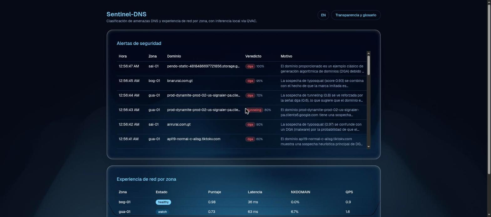
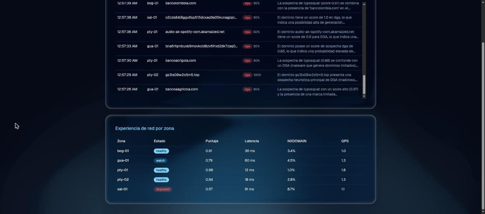
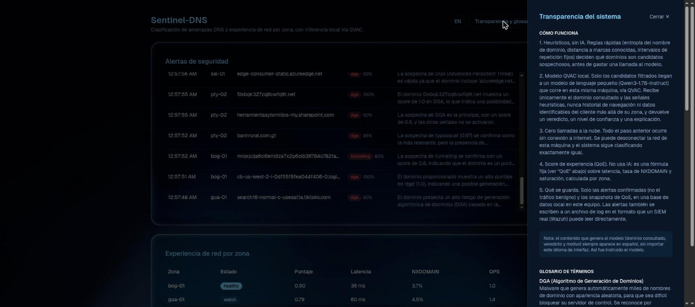

# Sentinel-DNS — Reto Ovnicom

Agente QVAC para el reto **"Sentinel-DNS"** de Ovnicom (Decentralized AI Hackathon, ISD
Summit Panamá). Se conecta como consumidor adicional de un stream de telemetría DNS, sin
tocar el pipeline de producción, y corre toda la inferencia on-device. Produce:

1. **Seguridad**: clasifica dominios sospechosos (DGA, typosquatting, tunneling, beaconing)
   y alerta a Wazuh.
2. **QoE**: score de calidad de red por zona, a partir de latencia, NXDOMAIN y saturación.

## Reuso (requerido por las reglas del hackathon)

Reutiliza base de la submission previa del equipo, [`Challenges/Phillips/`](../Phillips):

- `qvac_client.py`, copiado sin cambios.
- La forma de `api.py`/`db.py` (FastAPI delgado, sqlite plano).
- `confidence.py` → `qoe.py`. `extract.py` → `qvac_judge.py`.
- Frontend: `Background.tsx`, `GlassPanel.tsx` y sus dependencias, `ui/badge.tsx`,
  `ui/table.tsx`. No `StepShell.tsx`: esto es un dashboard, no un asistente de pasos.

Más detalle en [`../Phillips/context/README.md`](../Phillips/context/README.md). Repo
independiente por decisión del equipo.

## Cómo funciona

1. Lee el stream DNS: dataset real en `data/dns_logs/` si existe, si no, sintético.
2. Heurísticos baratos (entropía, distancia a marcas, intervalos fijos) filtran candidatos.
3. QVAC (Qwen3-1.7B-Instruct, local) da veredicto, confianza y motivo en español.
4. Todo veredicto sospechoso se guarda en sqlite y en `wazuh_alerts.log`.
5. El score de QoE se calcula con una fórmula fija, sin modelo.
6. El dashboard muestra ambas salidas en vivo.

## On-device, sin excepciones

`qvac_judge.classify` corre 100% local vía `tetherto.qvac_sdk`. El código no usa
`requests`/`urllib`/`httpx` ni abre sockets salientes. Desconecta la red de la máquina y
sigue funcionando igual.

## Real vs. simulado

| Stack real de Ovnicom | Aquí |
|---|---|
| BIND9 + dnstap | `bind_log.py` lee `named.log` real si `data/dns_logs/` existe; si no, tráfico sintético. Los ataques (DGA/typosquat/tunneling/beaconing) siempre son sintéticos. |
| Vector / Kafka | `pipeline.run_forever()`, tarea de fondo que consume del generador. |
| ClickHouse | sqlite (`db.py`). |
| Grafana | Dashboard React, polling cada 3s. |
| Wazuh | `wazuh_alerts.log`: JSON que un agente Wazuh real lee directamente. |

El dataset real (721MB, provisto por Ovnicom vía SharePoint) no está en el repo, está en
`.gitignore`. Sin él, el proyecto corre 100% sintético, permitido por las reglas del reto.

## Interfaz

Dashboard React de una sola pantalla. Paneles con efecto de vidrio (`GlassSurface`, React
Bits) sobre un fondo animado (`GradientWaves`, React Bits vía `ogl`). Selector ES/EN para
la interfaz; el contenido del modelo (dominio, veredicto, motivo) siempre queda en español.




Un botón abre un panel de **Transparencia y glosario**: explica el pipeline paso a paso y
define cada término técnico en pantalla.



## Instalación

```bash
python3 -m venv .venv
.venv/bin/pip install -r requirements.txt
cd frontend && npm install
```

Si el worker de QVAC no aparece solo: `.venv/bin/python -m tetherto.qvac_sdk install-worker`

## Ejecutar

```bash
./run.sh
```

Backend en `:8000`, frontend en `:5173`, Ctrl+C detiene ambos. La primera clasificación
tarda ~50s (carga del modelo); la tabla de alertas se ve vacía hasta entonces.

Manual: `.venv/bin/uvicorn api:app --port 8000 --reload` y `cd frontend && npm run dev`.

## Tests

```bash
.venv/bin/python -m pytest -q
```

Lógica pura de los heurísticos y el score de QoE. Sin modelo, corre en milisegundos.

## Estructura

| Archivo | Responsabilidad |
|---|---|
| `qvac_client.py` | Conexión y carga de modelos vía QVAC SDK (reusado de Philips) |
| `bind_log.py` | Parser de `named.log` de BIND9 + lector cíclico multi-archivo |
| `generator.py` | Stream de eventos: captura real (si existe) + ataques sintéticos |
| `detectors.py` | Heurísticos que filtran candidatos antes de gastar una llamada a QVAC |
| `qvac_judge.py` | Veredicto estructurado de QVAC sobre los candidatos filtrados |
| `qoe.py` | Score de QoE por zona: 0.5×latencia + 0.3×NXDOMAIN + 0.2×saturación |
| `db.py` | sqlite (alertas + snapshots de QoE) |
| `wazuh_sink.py` | Alertas confirmadas como JSON, formato ingerible por Wazuh |
| `pipeline.py` | Tarea de fondo: generador → detectores → QVAC → db + Wazuh |
| `api.py` | FastAPI, 2 rutas GET, arranca el pipeline en el lifespan hook |
| `frontend/` | Dashboard React (Vite + TypeScript + Tailwind + shadcn/ui) |

## Limitaciones conocidas

- QVAC (modelo pequeño) a veces reclasifica un `typosquat` como `dga`, ya que comparten
  señales de entropía a nivel de heurístico. La alerta sigue siendo válida.
- El heurístico de entropía también dispara en subdominios reales largos: confirmado con el
  dataset real (`tiktokv.com`, `cisco.com`, `azureedge.net` recibieron veredicto `dga` de
  baja confianza). Limitación conocida de los detectores por entropía en general, no un bug
  de esta implementación.
- La saturación del score de QoE rara vez domina frente a latencia/NXDOMAIN al ritmo de
  tráfico de esta demo.

## Guión de demo (para el video)

1. Dashboard recién levantado con la tabla de alertas vacía (~50s de carga del modelo).
2. Desconectar la red de la máquina en cámara, antes de la primera alerta.
3. Esperar una alerta de cada tipo: dga, typosquat, tunneling, beaconing.
4. Mostrar la tabla de QoE con una zona en estado degraded.
5. Abrir el panel de Transparencia y glosario.
6. `tail -f wazuh_alerts.log` en una terminal.
7. Mencionar el reuso de la base de Philips.

## Fuera de alcance (deliberado)

- Kafka/ClickHouse/Grafana/Wazuh real: sustituidos como en la tabla de arriba.
- Heurísticos configurables o aprendidos: cinco zonas fijas bastan para una demo.
